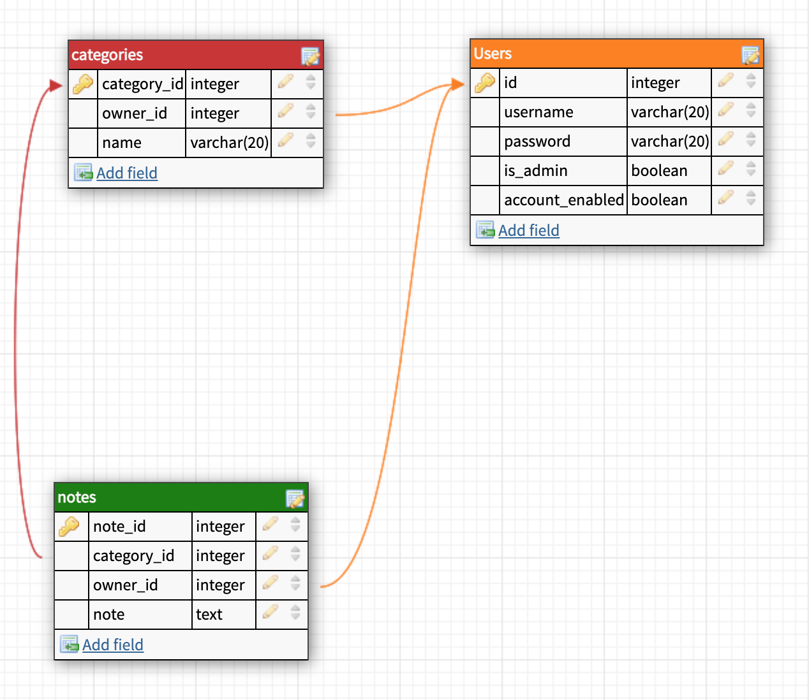

# one-internship

[description]

Features:
- 
You can register/login/logout.
User can create a new note, edit or delete existing note and view a list of already existing notes.
You can add a category to the note (list of categories are visible to user).
You can filter notes by category.

URLs:
GET /users - returns
....

## UML diagram

